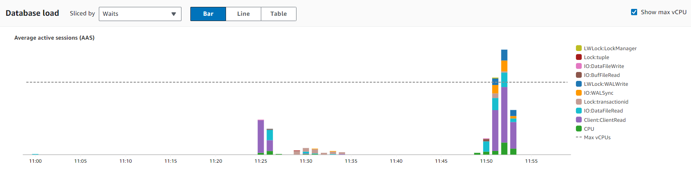

# Benchmarking several RDS for Postgres configs

* All configs will use the following RDS engine: PostgreSQL 16.1-R2
* Region `North Virginia` as it was the cheapest.

## Setup

```bash
dnf install -y \
	postgresql15-15.6-1.amzn2023.0.1.x86_64 \
	postgresql15-contrib-15.6-1.amzn2023.0.1.x86_64
```

```bash
export PGHOST=...
export PGUSER=...
export PGPASSWORD=...
export PGDATABASE=benchmark
```

```bash
$ psql -X -d postgres -c 'create database benchmark'

CREATE DATABASE
```

## Config 01

* Free tier
* db.t3.micro
	* 2 vCPUs
	* 1 GiB RAM
	* Network: 2,085 Mbps
* General Purpose SSD (gp2)
	* 20 GB
* No backup
* No encryption
### Default parameter group set by AWS
| Parameter                         | RDS Value | PG Default | RDS computation                                       |
| --------------------------------- | --------- | ---------- | ----------------------------------------------------- |
| `autovacuum_analyze_scale_factor` | 0.05      | 0.1        | 0.05                                                  |
| `autovacuum_max_workers`          | 3         | 3          | GREATEST({DBInstanceClassMemory/64371566592},3)       |
| `autovacuum_naptime`              | 15        | 60         | 15                                                    |
| `autovacuum_vacuum_scale_factor`  | 0.1       | 0.2        | 0.1                                                   |
| `max_connections`                 | 81        | 100        | LEAST({DBInstanceClassMemory/9531392},5000)           |
| `default_statistics_target`       | 100       | 100        | -                                                     |
| `effective_cache_size`            | 372 MB    | 4096 MB    | {DBInstanceClassMemory/16384}                         |
| `random_page_cost`                | 4         | 4          | -                                                     |
| `seq_page_cost`                   | 1         | 1          | -                                                     |
| `effective_io_concurrency`        | 1         | 1          | -                                                     |
| `max_parallel_workers`            | 8         | 8          | GREATEST(${DBInstanceVCPU/2},8)                       |
| `max_parallel_workers_per_gather` | 2         | 2          | -                                                     |
| `max_worker_processes`            | 8         | 8          | GREATEST(${DBInstanceVCPU*2},8)                       |
| `autovacuum_work_mem`             | 64 MB     | -1         | GREATEST({DBInstanceClassMemory/32768},65536)         |
| `maintenance_work_mem`            | 64 MB     | 64 MB      | GREATEST({DBInstanceClassMemory*1024/63963136},65536) |
| `shared_buffers`                  | 186 MB    | 128 MB     | {DBInstanceClassMemory/32768}                         |
| `work_mem`                        | 4096 kB   | 4096 kB    | -                                                     |
| `checkpoint_completion_target`    | 0.9       | 0.9        | 0.9                                                   |
| `max_wal_size`                    | 2048      | 1024       | 2048                                                  |
| `min_wal_size`                    | 192       | 80         | 192                                                   |
| `wal_buffers`                     | 5952 kB   | -1         | -                                                     |

### Preparing pgbench tables

```bash
$ pgbench -i -s 50

dropping old tables...
NOTICE:  table "pgbench_accounts" does not exist, skipping
NOTICE:  table "pgbench_branches" does not exist, skipping
NOTICE:  table "pgbench_history" does not exist, skipping
NOTICE:  table "pgbench_tellers" does not exist, skipping
creating tables...
generating data (client-side)...
5000000 of 5000000 tuples (100%) done (elapsed 5.49 s, remaining 0.00 s)
vacuuming...
creating primary keys...
done in 24.55 s (drop tables 0.00 s, create tables 0.01 s, client-side generate 7.94 s, vacuum 8.79 s, primary keys 7.80 s).
```

### Benchmarking

```bash
$ pgbench -c 10 -j 2 -t 10000

pgbench (15.6, server 16.1)
starting vacuum...end.
transaction type: <builtin: TPC-B (sort of)>
scaling factor: 50
query mode: simple
number of clients: 10
number of threads: 2
maximum number of tries: 1
number of transactions per client: 10000
number of transactions actually processed: 100000/100000
number of failed transactions: 0 (0.000%)
latency average = 15.607 ms
initial connection time = 221.231 ms
tps = 640.721594 (without initial connection time)
```





## Config 02

Same as Config 01, except:
* Storage changed to gp3
	* Baseline provisioned IOPS: 3000
	* Baseline storage throughput: 125

### Preparing pgbench tables

```bash
$ pgbench -i -s 50

dropping old tables...
creating tables...
generating data (client-side)...
5000000 of 5000000 tuples (100%) done (elapsed 5.09 s, remaining 0.00 s)
vacuuming...
creating primary keys...
done in 24.85 s (drop tables 0.05 s, create tables 0.03 s, client-side generate 7.68 s, vacuum 8.88 s, primary keys 8.21 s).
```

### Benchmarking

```bash
$ pgbench -c 10 -j 2 -t 10000

pgbench (15.6, server 16.1)
starting vacuum...end.
transaction type: <builtin: TPC-B (sort of)>
scaling factor: 50
query mode: simple
number of clients: 10
number of threads: 2
maximum number of tries: 1
number of transactions per client: 10000
number of transactions actually processed: 100000/100000
number of failed transactions: 0 (0.000%)
latency average = 14.596 ms
initial connection time = 186.093 ms
tps = 685.100239 (without initial connection time)
```


## Config 03

Same as Config 02, except:
* CPU Architecture switched to Graviton (ARM) - db.t4g.micro
	* 2 vCPUs
	* 1 GiB RAM
	* Network: 2,085 Mbps


### Preparing pgbench tables

```bash
$ pgbench -i -I d
$ pgbench -i -s 50

dropping old tables...
NOTICE:  table "pgbench_accounts" does not exist, skipping
NOTICE:  table "pgbench_branches" does not exist, skipping
NOTICE:  table "pgbench_history" does not exist, skipping
NOTICE:  table "pgbench_tellers" does not exist, skipping
creating tables...
generating data (client-side)...
5000000 of 5000000 tuples (100%) done (elapsed 3.65 s, remaining 0.00 s)
vacuuming...
creating primary keys...
done in 21.20 s (drop tables 0.00 s, create tables 0.02 s, client-side generate 4.83 s, vacuum 8.80 s, primary keys 7.55 s).
```

### Benchmarking

```bash
$ pgbench -c 10 -j 2 -t 10000

pgbench (15.6, server 16.1)
starting vacuum...end.
transaction type: <builtin: TPC-B (sort of)>
scaling factor: 50
query mode: simple
number of clients: 10
number of threads: 2
maximum number of tries: 1
number of transactions per client: 10000
number of transactions actually processed: 100000/100000
number of failed transactions: 0 (0.000%)
latency average = 13.113 ms
initial connection time = 190.033 ms
tps = 762.620347 (without initial connection time)
```


## Config 04

Same as Config 03, except:
* Storage changed to io2
	* Allocated storage: 100 GB (minimum for io2)
	* Provisioned IOPS: 3000 (minimum is 1000, set to 3000 to cope with the setting on gp3)

AWS told me I can't upgrade at the moment because I have recently performed a storage optimization (from gp2 to gp3), and I should wait at least 6 hours to perform another storage optimization.
For this reason, I deleted the DB instance and created a new one with `Config 04`.

### Preparing pgbench tables

```bash
$ pgbench -i -s 50

dropping old tables...
NOTICE:  table "pgbench_accounts" does not exist, skipping
NOTICE:  table "pgbench_branches" does not exist, skipping
NOTICE:  table "pgbench_history" does not exist, skipping
NOTICE:  table "pgbench_tellers" does not exist, skipping
creating tables...
generating data (client-side)...
5000000 of 5000000 tuples (100%) done (elapsed 3.80 s, remaining 0.00 s)
vacuuming...
creating primary keys...
done in 16.50 s (drop tables 0.00 s, create tables 0.01 s, client-side generate 4.13 s, vacuum 8.88 s, primary keys 3.48 s).
```

### Benchmarking

```bash
$ pgbench -c 10 -j 2 -t 10000

pgbench (15.6, server 16.1)
starting vacuum...end.
transaction type: <builtin: TPC-B (sort of)>
scaling factor: 50
query mode: simple
number of clients: 10
number of threads: 2
maximum number of tries: 1
number of transactions per client: 10000
number of transactions actually processed: 100000/100000
number of failed transactions: 0 (0.000%)
latency average = 10.918 ms
initial connection time = 183.054 ms
tps = 915.878040 (without initial connection time)
```


## Config 05

Same as Config 04, except:
* Instance type changed to `db.t4g.xlarge`
	* 4 vCPUs
	* 16 GiB RAM
	* Network: 2,780 Mbps

AWS told me I can't upgrade at the moment because I have recently performed a storage optimization (from gp2 to gp3), and I should wait at least 6 hours to perform another storage optimization.
For this reason, I deleted the DB instance and created a new one with `Config 04`.

### Main changes to parameter group values

| Parameter            | `db.t4g.xlarge` | `db.t3.micro` |
|----------------------|-----------------|---------------|
| max_connections      | 1727            | 81            |
| effective_cache_size | 7853 MB         | 372 MB        |
| autovacuum_work_mem  | 491 MB          | 64 MB         |
| maintenance_work_mem | 257 MB          | 64 MB         |
| shared_buffers       | 3927 MB         | 186 MB        |
| max_wal_size         | 6144            | 2048          |
| wal_buffers          | 64 MB           | 5952 kB       |

### Preparing pgbench tables

```bash
$ pgbench -i -I d
$ pgbench -i -s 50

dropping old tables...
NOTICE:  table "pgbench_accounts" does not exist, skipping
NOTICE:  table "pgbench_branches" does not exist, skipping
NOTICE:  table "pgbench_history" does not exist, skipping
NOTICE:  table "pgbench_tellers" does not exist, skipping
creating tables...
generating data (client-side)...
5000000 of 5000000 tuples (100%) done (elapsed 3.56 s, remaining 0.00 s)
vacuuming...
creating primary keys...
done in 6.23 s (drop tables 0.00 s, create tables 0.02 s, client-side generate 4.72 s, vacuum 0.25 s, primary keys 1.24 s).
```

### Benchmarking

```bash
$ pgbench -c 10 -j 2 -t 10000

pgbench (15.6, server 16.1)
starting vacuum...end.
transaction type: <builtin: TPC-B (sort of)>
scaling factor: 50
query mode: simple
number of clients: 10
number of threads: 2
maximum number of tries: 1
number of transactions per client: 10000
number of transactions actually processed: 100000/100000
number of failed transactions: 0 (0.000%)
latency average = 7.761 ms
initial connection time = 172.796 ms
tps = 1288.455218 (without initial connection time)
```


